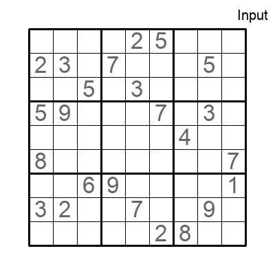

# Fast, easy-to-play-with Tiny Recursive Models

This is an implementation of the [Tiny Recursive Model (TRM)](https://arxiv.org/pdf/2510.04871v1). Watch the [in-code introductory video](https://youtu.be/8Gzv5tGmJ1M)!

Train a TRM in a few minutes on an A10. Reproduce the official TRM results. Push the envelope.

This project reproduces the results on Sudoku Extreme and Maze Hard (87% and 75% exact accuracy on validation, resp.)

LAST UPDATE (Jan, 2026): ConvSwigLU and BoardConvSwigLU are now available on top of the classic SwigLU. They are disabled by default.

<p align="center">

</p>

# Installation

This repo comes with `uv`. You just need to run `uv run python ...` commands and everything will be installed automagically on the first run.

# Sudoku Extreme

Generate data: 

`uv run python scripts/data/build_sudoku_extreme_dataset.py --output-dir ./data/sudoku_extreme_1k_aug_1k --subsample-size 1000 --num-aug 1000 --eval-ratio 0.01`

Run a training: 

`uv run python src/nn/train.py experiment=trm_sudoku_extreme_1k_aug_1k`

Training time ~1h on an H100 SXM5. You should get to ~87% exact accuracy on validation (same as the reference implementation)

# Maze Hard

Generate data: 

`uv run python scripts/data/build_maze_dataset.py --output-dir ./data/maze-30x30-hard-1k --num-aug 0 --eval-ratio 1.0`

Run a training: 

`uv run python src/nn/train.py experiment=trm_maze`

Training time ~2h on an H100 SXM5. You should get to ~75% exact accuracy on validation (same as the reference implementation)

# Small Sudoku datasets

Generate data:

`bash bash/generate_sudoku_data.sh` -> choose which dataset you want to generate

Run a training:

`uv run python src/nn/train.py experiment=trm_sudoku_4x4`

# ARC-AGI

Download the data from the [kaggle challenge page](https://www.kaggle.com/competitions/arc-prize-2025).

# Less (Really) is More: iterate on smaller datasets

Generate a Sudoku dataset: 

`./bash/generate_sudoku_data.sh`

Test/visualize the data: 

`uv run tests/src/nn/data/test_sudoku_data.py <data_dir>`

Run a training: 

`uv run python src/nn/train.py experiment=trm_sudoku4x4` 

Takes a few mins on an A10

Independant evaluation with visualizations: 

`uv run python src/nn/evaluate.py +checkpoint=/tmp/ml-experiments/lunar-pine-174/checkpoints/last.ckpt +data_dir=./data/sudoku_4x4_small`

Sudoku:
- Evaluate and generate a gif: `uv run python src/nn/evaluate.py +checkpoint=./checkpoints/smooth-sunset-204.ckpt +data_dir=./data/sudoku-extreme-1k-aug-1k +visualize=true +save_gif=true +min_steps=9`

Maze:

- Generate a dataset with test data (not just val): `uv run python scripts/data/build_maze_dataset.py --output-dir ./data/maze-30x30-hard-1k --num-aug 0 --eval-ratio 0.5`
- Evaluate and generate a gif: `uv run python src/nn/evaluate.py +checkpoint=./checkpoints/stellar-shape-194.ckpt +data_dir=./data/maze-30x30-hard-1k +visualize=true +save_gif=true +min_steps=9 +task=maze`

# Comments / contributions

Follow me on [X](https://x.com/olivkoch)

# Technical Notes

## Sweeps

Create sweep

```
uv run python scripts/create_sweep.py \
    --sweep-file src/nn/configs/sweeps/trm_sweep.yaml \
    --project trm-sudoku
```

Run sweep agent

```
uv run python src/nn/train_sweep.py \
    --sweep-id <sweep_id> \
    --project trm-sudoku \
    --experiment trm_sudoku6x6 \
    --count 20
```

## Installing AdamATan2

This project uses the vanilla AdamW optimizer if AdamATan2 is not installed. If you want AdamATan2 and struggle to install it, here is how to install it from source:

```
# Clone the repo
cd /tmp
git clone https://github.com/imoneoi/adam-atan2.git

cd adam-atan2/

uv pip install --python /home/ubuntu/nano-trm/.venv/bin/python --verbose --no-cache-dir --no-build-isolation -e .

# Test
cd /home/ubuntu/nano-trm
uv run python
from adam_atan2 import AdamATan2 -> this should work
```
