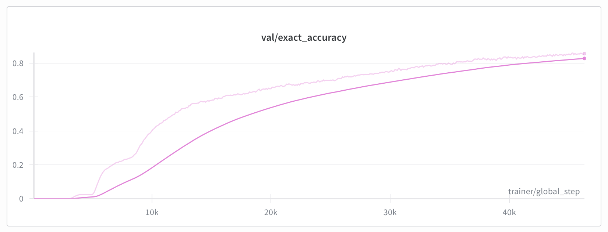

# An implementation of TRM

This is an implementation of the [Tiny Recursive Model (TRM)](https://arxiv.org/pdf/2510.04871v1). Reference [code](https://github.com/SamsungSAILMontreal/TinyRecursiveModels)

Train a TRM in a few minutes on an A10! Or reproduce the official TRM results and push the envelope.

Watch the [in-code introductory video](https://youtu.be/8Gzv5tGmJ1M)!



# Installation

This repo comes with `uv`. You just need to run `uv run python ...` commands and everything will be installed automagically on the first run.

# Sudoku Extreme

Generate data: 

`uv run python scripts/data/build_sudoku_extreme_dataset.py --output-dir ./data/sudoku_extreme_1k_aug_1k --subsample-size 1000 --num-aug 1000 --eval-ratio 0.01`

Run a training: 

`uv run python src/nn/train.py experiment=trm_sudoku_extreme_1k_aug_1k`

Training time ~10h on an H100 SXM5. You should get to ~87% exact accuracy on validation (same as the reference implementation)

# Maze Hard

Generate data: 

`uv run python scripts/data/build_maze_dataset.py --output-dir ./data/maze_30x30 --num-aug 7 --eval-ratio 0.5`

Run a training: 

`uv run python src/nn/train.py experiment=trm_maze`

Training time ~20h on an H100 SXM5. You should get to ~85% exact accuracy on validation (same as the reference implementation)

# ARC-AGI

Download the data from the [kaggle challenge page](https://www.kaggle.com/competitions/arc-prize-2025).

Experiments in progress.

# Less (Really) is More: iterate on smaller datasets

Generate a Sudoku dataset: 

`./bash/generate_sudoku_data.sh`

Test/visualize the data: 

`uv run tests/src/nn/data/test_sudoku_data.py <data_dir>`

Run a training: 

`uv run python src/nn/train.py experiment=trm_sudoku4x4` 

Takes a few mins on an A10

Independant evaluation with visualizations: 

`uv run python src/nn/evaluate.py +checkpoint=/tmp/ml-experiments/lunar-pine-174/checkpoints/last.ckpt +data_dir=./data/sudoku_4x4_small`

# Self-Play (WIP)

Our long-term goal is to use TRM for self-play. This section is very much WIP.

Generate curriculum training data by pitching two minimax players against each other: `uv run python scripts/data/generate_c4_curriculum_data.py --n-games 50000 --temp-player1 0.1 --temp-player2 0.3 --depth 4 --to-file minimax_games_.pkl`

Set `enable_selfplay=False` to enable/disable self-play in `experiment/mlp_c4.yaml`

Then run `uv run python src/nn/train_c4.py experiment=mlp_c4.yaml`

Replace `mlp` with `cnn` or `trm` for CNN or TRM.

The training script produces the evaluation metrics automatically.

# Comments / contributions

Follow me on [X](https://x.com/olivkoch)

# Sweeps

## 1. Create sweep
```uv run python scripts/create_sweep.py \
    --sweep-file src/nn/configs/sweeps/trm_sweep.yaml \
    --project trm-sudoku
```

## 2. Run agent
```uv run python src/nn/train_sweep.py \
    --sweep-id <sweep_id> \
    --project trm-sudoku \
    --experiment trm_sudoku6x6 \
    --count 20
```

